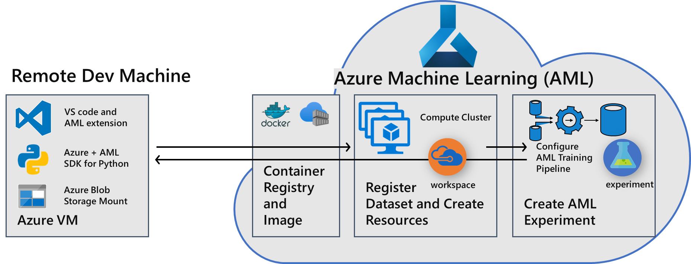

# Azure ML

## Overview
This repository utilizes Azure ML to train `detectron2` and `yolact` based models. Refer to the below diagram for an architecture overview of the implemented method. 



### AML Demo Development Status and Content

Azure Machine Learning Service Demo

* [x] [setting up environment](https://docs.microsoft.com/en-us/azure/machine-learning/how-to-configure-environment)
* [x] connect data set
* [x] set up environment
* [x] training 
  * [x] Detectron2
  * [ ] Yolact _(need to finish)_
  * [ ] [Yolov5](https://github.com/ultralytics/yolov5)
  * [ ] [Pytorch.segmentation_models](https://github.com/qubvel/segmentation_models.pytorch)
* [ ] model evaluaiton
* [ ] model registration 
* [ ] model deployment and operationation 
* [ ] Azure ML Experiment Logging, Metrics and Eval Image Samples


## Quick Start

Quick start for utilized detectron2 and yolact for AzureML training. Please follow this [Azure ML Doc](https://docs.microsoft.com/en-us/azure/machine-learning/overview-what-is-machine-learning-studio) for setting up initial AzureML Environment. 

1. Finalize training dataset and coco annotations 
2. update model training configs and dataset info in either the `aml_detectron2` or `aml_yolact` `aml_code` folder
3. update required training config in the `experiment_cfg.py` file
4. run `python aml_new_experiment.py`


## Installation 

1. Clone this repository ([git installation required](https://git-scm.com/))
   ```sh
   cd $HOME # or another directory for this project/repo
   git clone https://github.com/naivelogic/azureml_cv.git
   cd azureml_cv
   ```

1. Tools that I am using
   - [Visual Studio Code](https://code.visualstudio.com/Download)

2. Install environment with [Anaconda](https://www.continuum.io/downloads): 
   
   ```sh
   conda env create -f azureml-env.yml 
   conda activate azureml

   ## if using Jupyter Notebooks create custom jupyter kernel for AzureML
   python -m ipykernel install --user --name=azureml

   jupyter nbextension install --py --user azureml.widgets
   jupyter nbextension enable azureml.widgets --user --py
   ```

3. Login to Azure on the command line
   > seems like i need to run `az login --use-device-code` to initialize each session for authentication to the AML workspace (i have multiple AML across different subscriptions and tenants)
   ```sh
   # azure cli linux 
   ## install az function tools
   # https://docs.microsoft.com/en-us/cli/azure/install-azure-cli-linux?pivots=apt
   curl -sL https://aka.ms/InstallAzureCLIDeb | sudo bash

   # now log in 
   az login --use-device-code

   # may also need to install this package if getting authentication errors
   pip install azure-cli-core
   ```


